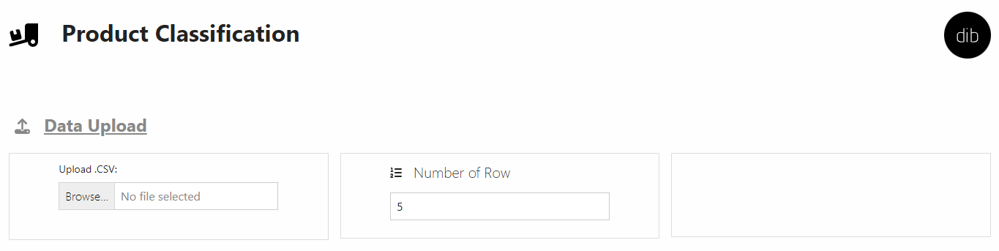
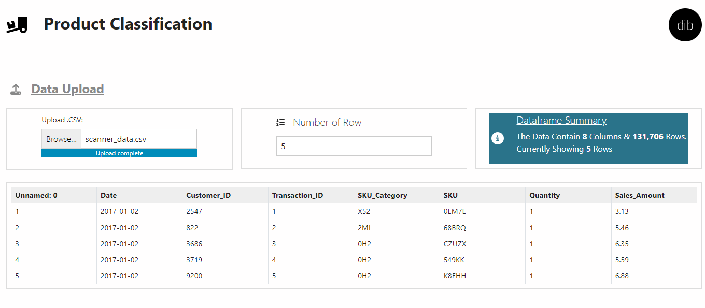
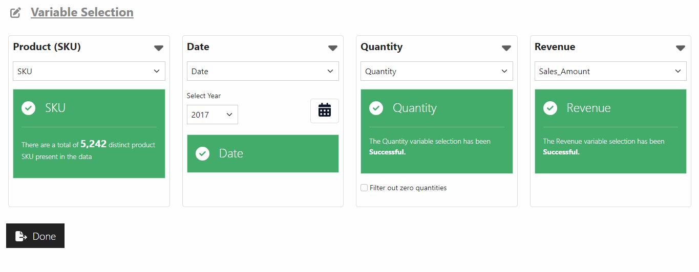
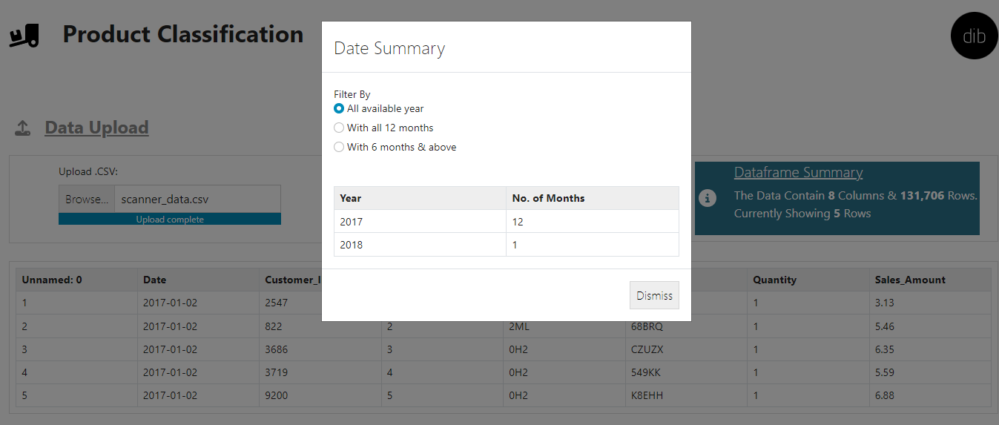
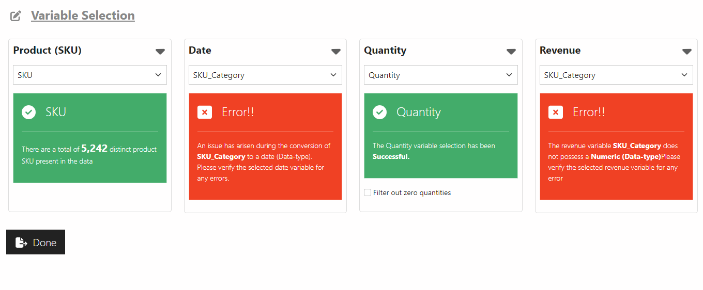
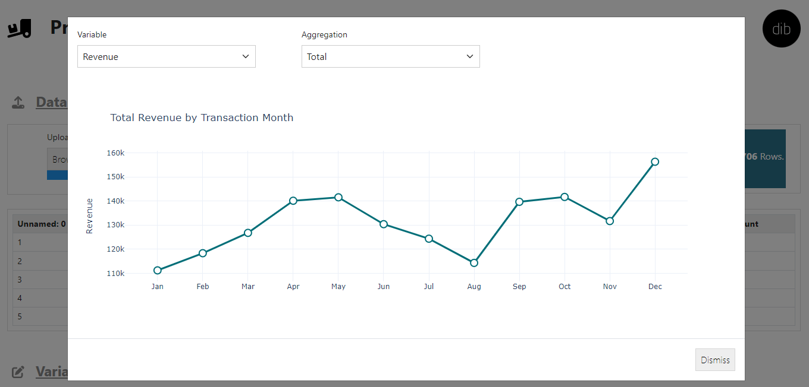
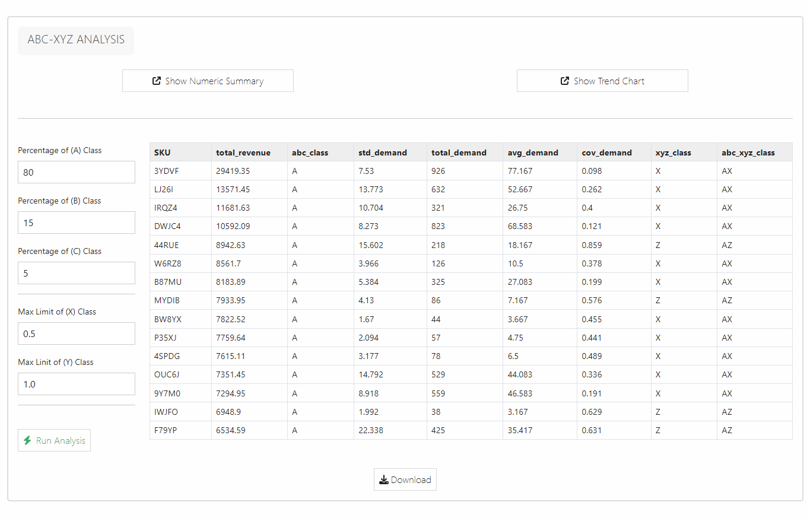
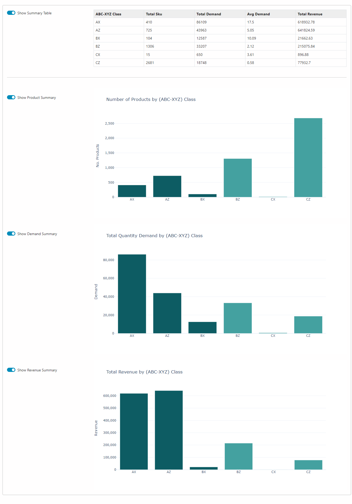

## Product Classification Analysis.

**Introduction:**

The presented shiny application offers a user-friendly solution for efficiently classifying inventory using ABC, XYZ, or ABC-XYZ analysis. With its straightforward approach, this tool simplifies the classification process without requiring complex logic. Users can expect swift results, provided they possess a well-structured dataset containing key variables, namely the product SKU, sale date, unit quantity sold, and revenue generated. These variables are essential for conducting the analysis. To perform the classification successfully, follow the outlined steps below.

The initial step in the classification process is to import a clean .CSV file containing the required variables, ensuring that there are no NULL or missing values present. To accomplish this, simply click on the "Upload Data" button within the application's interface. This action will prompt you to select the appropriate file from your local system.

Once the file is successfully uploaded, the shiny application will generate a preview table displaying a subset of the data. This preview provides an initial glimpse into the imported dataset. Additionally, an option will be available to view more rows of the data, allowing for a more comprehensive examination of the uploaded information. This feature enables users to verify the correctness and completeness of their dataset before proceeding further.

Upon uploading the data, the application will present the information from each column of the dataset, including their names, for selection. It is crucial at this stage to carefully choose the relevant variables for the classification analysis. Specifically, you will need to select the SKU (product identifier), date, unit quantity, and revenue variables from the available options. These selected variables serve as the foundation for conducting the subsequent inventory classification.

Regarding the date section, it offers additional options for analyzing dates, such as selecting a specific analysis year. By utilizing this feature, users can focus on a particular year for their inventory classification.

After selecting the variables for SKU, date, unit quantity, and revenue, the shiny application will validate their format and data types. If the chosen variables align with the expected formats, such as SKU being either a string or a number, date as a date, datetime, or timestamp, unit quantity as an integer, and revenue as an integer or float, a notification will be displayed. This notification will confirm the successful selection of variables and indicate that the classification process can proceed.

However, if any of the selected variables do not match the expected formats, an error message will be displayed. This error message will alert you to review and rectify the variable selection before proceeding further. Ensuring the correct format and data types are selected is crucial for accurate inventory classification results.

Once the variables have been successfully selected, the application will present you with links to perform the desired analyses. These links will include options for ABC analysis, XYZ analysis, or both ABC-XYZ analysis. You can choose the type of analysis you want to perform by clicking on the respective link. This flexibility allows you to tailor the classification approach to your specific needs and requirements.

Once you have selected your preferred type of analysis, the shiny application offers several options to further customize the classification process. Firstly, you have the ability to generate a quick data summary for both the quantity variable and the revenue. This summary provides an overview of key statistics and insights related to these variables, aiding in better understanding the data before proceeding with the analysis.

Additionally, the application allows you to fine-tune the threshold values for each class. This flexibility enables you to adjust the classification criteria according to your specific preferences and business requirements. By modifying these thresholds, you can precisely define the boundaries for each class, resulting in more accurate and meaningful classification outcomes.

The results of the analysis will be presented in the form of a dataframe, which will be displayed within the shiny application. This dataframe provides a comprehensive view of the classified inventory, including the assigned classes and any additional relevant information. Furthermore, you will have the option to download this dataframe for further analysis or reporting purposes, allowing for seamless integration with other tools or workflows.

In addition to the previous features, the application also offers an optional and final stage where you can create summaries of the analysis results. These summaries provide insights into the distribution of products across different classes based on specific conditions.

These summaries provide a comprehensive overview of the classification results, allowing you to make informed decisions and draw meaningful conclusions based on the analysis outcomes.

